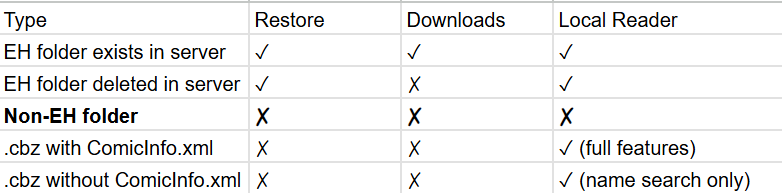

## EhViewer_Grid

  

My modification of EhViewer Kotlin with new features, UI and bug fix.

*for my own use. not maintained. 

# What's different:
- Manage and read local galleries along with EhViewer downloaded galleries with a built-in file tree support  
- A search feature that could parse ComicInfo.xml even with non-Eh galleries  
- DB entry clean feature  
- Mesh grided thumbnail view with titles    
- Enhanced horizontal gallery thumbnail view(2 grid spaces horizontally)    
- Select button in download in thumbnail view    
- Manual timestamp for recording reading status    
- Download size optimization    
- Downloaded gallery thumbnail resolution fix(remove the low res thumbnail, now use the first image as thunbnail)    
- Device UI optimization  
- Extra FAB features  

If you are intersted in importing your local galleries to Ehviewer-Grid, below is for you to understand what could be imported with the restore download items feature, and what could be recognizable by the local reader. All images in **EH's gallery folders** must be renamed to 0%8d format, like 00000001.*, or the restore download item function will not recognize these images(if they are from EhViewer then you don't need to do that). Local galleries that has no ComicInfo.xml in folder, or no Exhentai/Ehentai link present in ComicInfo.xml must be stored as .cbz file(See Type 3). To use the Local Reader, you must set the download's viewing to grid as the feature is build with download instance and only supports grid view. 

                                                                                                          

  

# Features

## Local Reader

  

## Mesh Grided View with Title and Horizontal View. The 2 buttons on search bar are time stamp and jump to last time stamp.

  

# What's next
Local gallery DB - done   
Support of other sites - Hard to implement due to og app structure. I suggest use other apps to download and manually .cbz it.   
Test - done with my fine collection of over 11,000 dojinshis and mangas.  

