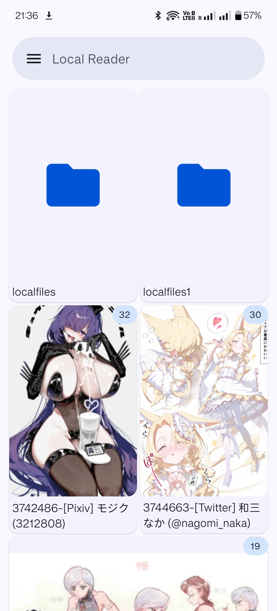
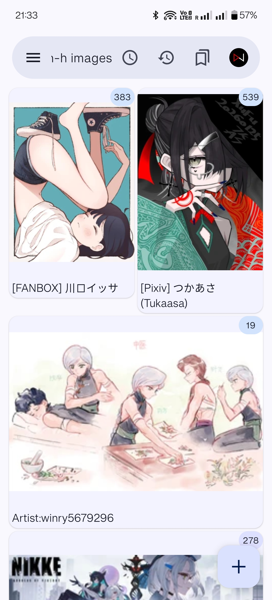

## EhViewer_Grid

  

My modification of EhViewer Kotlin with new features, UI and bug fix.

*for my own use. not maintained

# What's different:
Manage and read local galleries along with EhViewer downloaded galleries, with folder tree  
A search feature that could parse ComicInfo.xml even with non-Eh galleries  
DB entry clean   
Mesh grided thumbnail view with titles    
Enhanced horizontal gallery thumbnail view    
Selection in download in thumbnail view    
Manual timestamp for recording reading status    
Download size optimization    
Downloaded gallery thumbnail resolution fix    
Device UI optimization(for my y700gen4 lol)    
If you are intersted to import your local galleries to Ehviewer-Grid, this guide is for you to understand what could be imported, and what could be recognizable by the local reader. All of the images must be renamed to 0%8d format. Local galleries THAT ARE NOT ON EH(Has no ComicInfo.xml or no Exhentai/Ehentai link present in ComicInfo.xml)must be stored as .cbz file.(See Type 3)      
                                                                                                                                                                                       
  ┌────────────────────────────┬─────────┬───────────┬───────────────────┐                                                                                                                               
  │            Type            │ Restore │ Downloads │   Local Reader    │                                                                                                                               
  ├────────────────────────────┼─────────┼───────────┼───────────────────┤                                                                                                                               
  │ EH folder exists in server │ ✓       │ ✓         │ ✓                 │                                                                                                                               
  ├────────────────────────────┼─────────┼───────────┼───────────────────┤                                                                                                                               
  │ EHfolder deleted in server │ ✓       │ ✗        │ ✓                 │                                                                                                                               
  ├────────────────────────────┼─────────┼───────────┼───────────────────┤                                                                                                                               
  │ **Non-EH folder**          │ **✗**   │ **✗**    │ **✗**             │                                                                                                                               
  ├────────────────────────────┼─────────┼───────────┼───────────────────┤                                                                                                                               
  │ .cbz with ComicInfo.xml    │ ✗       │ ✗        │ ✓ (full features) │                                                                                                                               
  ├────────────────────────────┼─────────┼───────────┼───────────────────┤                                                                                                                               
  │ .cbz without ComicInfo.xml │ ✗       │ ✗        │ ✓(name search only)         │                                                                                                                               
  └────────────────────────────┴─────────┴───────────┴───────────────────┘ 

# Features

## Local Reader

  

## Mesh Grided View with Title and Horizontal View

  

# What's next
Local gallery DB - done
Support of other sites - Hard to implement due to og app structure. I suggest use other apps to download and manually .cbz it.
Test - done

